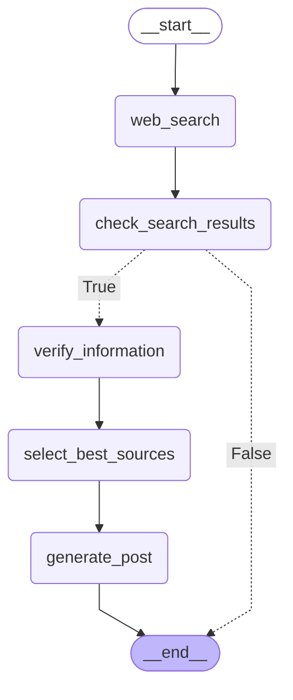

```mermaid
---
config:
  flowchart:
    curve: linear
---
graph TD;
	__start__([<p>__start__</p>]):::first
	web_search(web_search)
	check_search_results(check_search_results)
	verify_information(verify_information)
	select_best_sources(select_best_sources)
	generate_post(generate_post)
	__end__([<p>__end__</p>]):::last
	__start__ --> web_search;
	generate_post --> __end__;
	select_best_sources --> generate_post;
	verify_information --> select_best_sources;
	web_search --> check_search_results;
	check_search_results -. &nbsp;True&nbsp; .-> verify_information;
	check_search_results -. &nbsp;False&nbsp; .-> __end__;
	classDef default fill:#f2f0ff,line-height:1.2
	classDef first fill-opacity:0
	classDef last fill:#bfb6fc

```